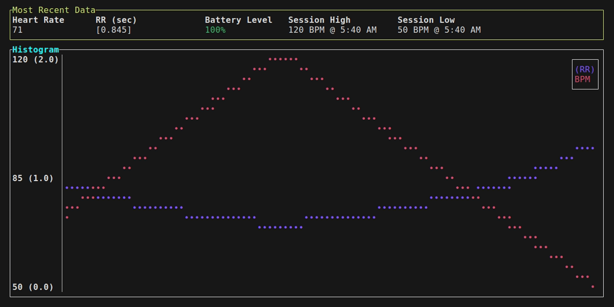

[](https://github.com/nullstalgia/iron-heart/actions/workflows/build.yml)

# iron-heart

A BLE Heart Rate Monitor bridge built in Rust for use with OSC in Social VR, OBS, general biometric data-logging, and more!

## Demo



## Features

- Supports any BLE-specification-following Heart Rate Monitor! (Many by Polar, Coospo, etc.)
- Supports receiving heart rate data via WebSockets with JSON payloads!
- Accurate per-heart-beat effects: Using the monitor's reported time between heart beats (RR Interval), we can drive avatar effects that match your heart's beating!
- Quick reconnection to saved device on app startup
- Terminal UI and Charts: Powered by [Ratatui](https://ratatui.rs/)
- CSV Logging, review your past sessions!
- Prometheus Push logging for [metrics](pic)! Compatible with [VictoriaMetrics](https://docs.victoriametrics.com/url-examples/#apiv1importprometheus) too!
- Text file output, perfect for an OBS Text Source!
- Self-Updating!
- Can auto-start with VRChat using VRCX's App Launcher
- Dummy Mode: Test avatars and prefabs without needing to put on/own a sensor
- Hide temporary disconnections (optional): In case of spotty connections, this can help mask those moments of signal loss

## How to use
1. Place the executable in a convenient spot
    - It will generate a log file and configuration file on first launch
    - If you have VRCX installed, it will offer to enable auto-launching with VRChat by generating a shortcut in VRCX's App Launcher folder.
2. Power on and wear the Heart Rate sensor
3. Find the device in the list of Discovered Devices
    - Only compatible devices\* will be shown in the list!
    - If your device does not show up in the list, make sure it's powered on and in range of your Bluetooth Adapter
    - If your device is a Smartwatch/Mi Band/other more complex smart gadget that has a HR Sensor, it may not be compatible.
4. Connect, and done!
    - The rest is up to you! You can use [my free Heart Rate Prefab for VRChat](https://nullstalgia.booth.pm/items/5156075), make your own systems, use it with OBS, etc!
    - See below for the default parameter names, and their types.

\*: devices that advertise the Heart Rate Measurement characteristic. Usually devices whose main purpose is to measure heart rate will advertise this (i.e. Polar/Coospo/etc sensors)!

## Configuration File
### iron-heart.toml (default)

```toml
[osc]
enabled = true
host_ip = "0.0.0.0"
target_ip = "127.0.0.1"
port = 9000
# Duration in MS that `param_beat_pulse` will be true for each "beat"
pulse_length_ms = 100
only_positive_float_bpm = false
# If app loses connection to sensor, it will keep the Connected bool true and jitter the value slightly to mimic a connection.
hide_disconnections = false
max_hide_disconnection_sec = 60
twitch_rr_threshold_ms = 50

[osc.addresses]
prefix = "/avatar/parameters/"
# Bool
hrm_connected = "isHRConnected"
# Bool: See hide_disconnections
hiding_disconnect = "isHRReconnecting"
# Int: 0 - 100
hrm_battery_int = "HRBattery"
# Float: 0.0 - 1.0
hrm_battery_float = "HRBatteryFloat"
# Bool: On each heart beat, this param flip/flops
beat_toggle = "HeartBeatToggle"
# Bool: See pulse_length_ms
beat_pulse = "isHRBeat"
# Int: 0 - 255
bpm_int = "HR"
# Float: -1.0 to 1.0 (or 0.0 to 1.0 if only_positive_float_bpm)
bpm_float = "floatHR"
# Int: Only useful for local debugging, value is too large to sync (goes over 255)
latest_rr_int = "RRInterval"
# Bool params that hold True for a moment if RR Interval changed more than the threshold
# Useful for triggering ear twitches or similar!
rr_twitch_up = "HRTwitchUp"
rr_twitch_down = "HRTwitchDown"
# Int: 0 - 255, index of chosen Activity
activity = "HRActivity"

[ble]
never_ask_to_save = false
saved_name = ""
saved_address = ""
# If no RR was supplied for an update, burn X values before using new ones
rr_ignore_after_empty = 0

[websocket]
# Note: BLE is disabled if websockets are enabled
enabled = false
port = 5566

[misc]
log_level = "info"
# Useful for OBS
write_bpm_to_file = false
# Writes under BPM
write_rr_to_file = false
bpm_file_path = "bpm.txt"
log_sessions_to_csv = false
log_sessions_csv_path = "session_logs"
# Used to dismiss VRCX startup prompt
vrcx_shortcut_prompt = true

[dummy]
# Ignore BLE and WebSockets entirely, just send values for testing
enabled = false
low_bpm = 50
high_bpm = 120
# How many packets to send per second
bpm_speed = 1.5
# How many cycles from low->high before simulating a disconnect, 0 to disable
# Will trigger hide_disconnections behavior if also enabled
loops_before_dc = 2

[tui]
session_stats_use_12hr = true
chart_bpm_enabled = true
chart_rr_enabled = true
chart_rr_max = 2.0
chart_rr_clamp_high = true
chart_rr_clamp_low = false
# False to show charts side-by-side
charts_combine = true

[updates]
update_check_prompt = true
allow_checking_for_updates = false
version_skipped = ""

[activities]
# Allow choosing an activity in the TUI, useful for log analysis
enabled = false
# On startup, set the activity to the last used one
remember_last = true

[prometheus]
# When enabled, will POST metrics to the specified URL
# in Prometheus Text Exposition format
enabled = false
url = "localhost:9000"
header = ""

# Any metric can be disabled by setting it to an empty string
[prometheus.metrics]
bpm = "heart_rate_bpm"
rr = "heart_rate_rr"
battery = "heart_rate_battery"
twitch_up = "heart_rate_twitch_up"
twitch_down = "heart_rate_twitch_down"
activity = "heart_rate_activity"
```

## Known Compatible WebSocket Senders

- [HeartSoos](https://play.google.com/store/apps/details?id=lucheart.heartsoos.wearapp) by [LucHeart](https://github.com/LucHeart) for WearOS - Supports sending BPM only

## Alternatives

If you want to see a C# implementation or need OSCQuery/Quest Standalone support, check out [Natsumi-sama](https://github.com/Natsumi-sama)'s [HRPresence](https://github.com/Natsumi-sama/HRPresence).

## Acknowledgments/Author Notes

- This is my first Rust project! If you see any glaring issues, let me know!
- This project is based on [Zackary Troop](https://github.com/ztroop)'s [btlescan](https://github.com/ztroop/btlescan) project! It provided a great starting point for me, as I was already wanting to use [btleplug](https://github.com/deviceplug/btleplug) and [Ratatui](https://github.com/ratatui-org/ratatui).
- Many thanks to [Nathan Fairhurst](https://github.com/IamfromSpace) for their robust BLE HR Measurement packet decoding snippet (from [rust-cycle](https://github.com/IamfromSpace/rust-cycle))!
- More thanks to burntsushi for their blog posts on Rust, namely [Error Handling in Rust](https://blog.burntsushi.net/rust-error-handling/).
- Cheers to [Strophox](https://github.com/Strophox/tetrs) for inspiring this section

Addendum:
- A massive shoutout to Will Crichton [@willcrichton](https://github.com/willcrichton) and the [Cognitive Engineering Lab](https://cel.cs.brown.edu/)'s work on the [Experimental Rust Book](https://rust-book.cs.brown.edu/). I owe my ability to write and understand Rust code at this level to them and that book.
